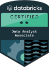

# 👋 Hi, I'm Claudia Tangerino Olivares  

🎯 Senior BI & Data Analyst | Power BI | SQL | Databricks | Python | Cloud Analytics

I’m passionate about transforming data into insights that drive strategic decisions.  
With over 8 years of experience in **Business Intelligence and Data Analytics**, I’ve helped companies in **finance, retail, and technology** adopt a data-driven culture, optimize performance, and modernize their data ecosystems.

---

## 🎓 Certifications  

  
  

---

## Featured Projects  

###  Ecommerce Sales Dashboard – *Power BI* 
- **Goal:** Analyze sales and customer performance across multiple marketplaces.  
- **Stack:** Power BI, SQL, DAX, Data Modeling  
- **Highlights:**  
  - Designed star schema and advanced DAX measures for KPIs (GMV, MoM, YoY).  
- [View Project](https://app.powerbi.com/view?r=eyJrIjoiZWJlODZmNTItODlmNi00MmI0LWFjYWUtNGMwNzM3ZWNlYmJlIiwidCI6IjhlODhhNGE0LWNkYjctNGM3YS04MTRhLTk1OTMyY2RhM2Q5ZiJ9)  

---

###  Beverage Sales Dashboard – *Power BI*
- **Goal:** Analyze beverage sales performance to identify trends, key metrics, and improvement opportunities.  
- **Stack:** Power BI, SQL, DAX, Data Modeling  
- **Highlights:**  
  - Delivered actionable insights on beverage sales trends and profitability.  
  - Improved data-driven decision-making through KPI analysis and visual reporting.  
  - Supported strategic planning by identifying market growth and optimization areas.    
- [View Project](Beverages_orders.pbix)  

---

###  Marketing Analysis – *Python*
- **Goal:** The goal of this A/B test analysis was to evaluate the performance of two marketing website versions — AD (test group) and PSA (control group) — in terms of conversion rates.  
- **Stack:** Python, Matplotlib  
- **Impact:**
  - AD conversion rate: **2.62%**
  - PSA conversion rate: **1.82%**
  - **p-value = 1.99e-13** → statistically significant difference  
  - The ad version outperformed the control, showing a clear positive uplift in conversions..  
- [View Project](Test_AB.zip) 

---

## Tech Stack  

**Languages & Tools:**  
`SQL` · `Python` · `PySpark` · `R` · `Power BI` · `Tableau` · `Azure Databricks` · `DAX` · `GitHub`  

**Cloud & Data Engineering:**  
`Azure Data Lake` · `Delta Lake` · `ETL Pipelines` · `Data Modeling`   

**Soft Skills:**  
`Problem Solving` · `Analytical Thinking` · `Data Storytelling` · `Business Partnering`

---

## 🧠 Current Focus  
- Building end-to-end BI solutions with **Databricks + Power BI**  
- Learning more about **LLMs, RAG, and Prompt Engineering** for analytics  
- Exploring **Python automation** for data workflows  

---

## 📫 Let's Connect  

🌐 [LinkedIn](https://www.linkedin.com/in/claudiatangerino)  
📍 São Paulo, Brazil  

---

> *“Data is not just numbers — it’s the story behind every decision.”*
